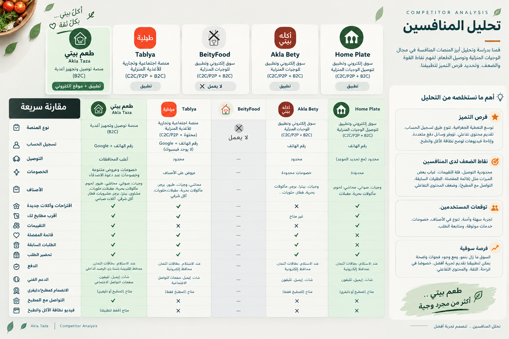
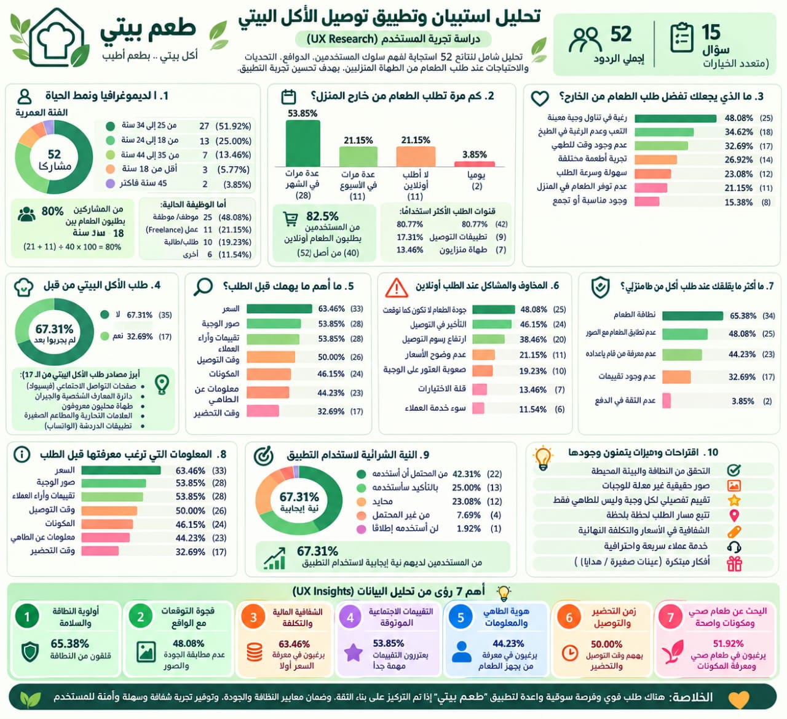

# 🍲 Ta'am Beity — UI/UX Case Study

## 📎 Project Name
**Ta'am Beity (طعم بيتي)** — Home-Cooked Food Ordering Platform

## 📌 Project Overview
Ta'am Beity is a home-cooked food ordering platform designed to connect customers with homemade food providers. The project focuses on creating a simple, intuitive, and user-friendly experience that helps users discover homemade meals, explore different food options, and place orders conveniently.

This UI/UX case study documents the design process, including user research, market and competitor analysis, identifying user needs, developing user personas, organizing the user journey, and designing the user interface.

## 👥 Team Members
1. **Moamen Abdel-Latif**
2. **Marah Othman**
3. **Mona Mahmoud**
4. **Angham Atef**
5. **Mohamed El-Beid**

## 📎🎓 Instructor
**Mohamed Kamar**

## 🎯 Project Objectives
- Understand users' needs, behaviors, and pain points when ordering homemade food.
- Conduct market research and competitor analysis.
- Identify opportunities to improve the home-cooked food ordering experience.
- Create user personas and understand customer expectations.
- Design intuitive user flows and clear navigation.
- Develop wireframes and user interface designs.
- Provide a convenient and trustworthy experience for customers and home-based food providers.

## 📦 Project Scope
- User Research and Problem Definition
- Market Research and Competitor Analysis
- User Personas and Empathy Maps
- User Needs and Pain Points
- Information Architecture
- User Flows and Customer Journey
- Wireframes and UI Design
- Prototyping and Design Refinements
- Final UI/UX Case Study Presentation

## 📅 Project Plan (5 Weeks)

| Week | Activities |
|---|---|
| Week 1 | Project discovery, problem definition, and user research |
| Week 2 | Market research, competitor analysis, and research insights |
| Week 3 | User personas, empathy maps, information architecture, and user flows |
| Week 4 | Wireframes, UI design, and interactive prototyping |
| Week 5 | Design refinements, final documentation, and case study presentation |

---

### 📁 Project Deliverables
- Research and competitor analysis
- User personas and empathy maps
- User flows and wireframes
- UI screens and prototype
- Final UI/UX case study

**Project Type:** UI/UX Design  
**Team Size:** 5 Members  
**Instructor:** Mohamed Kamar

### . Competitor Analysis

### . Survey Analysis

### 6. Wireframes

### 7. Final UI Design

